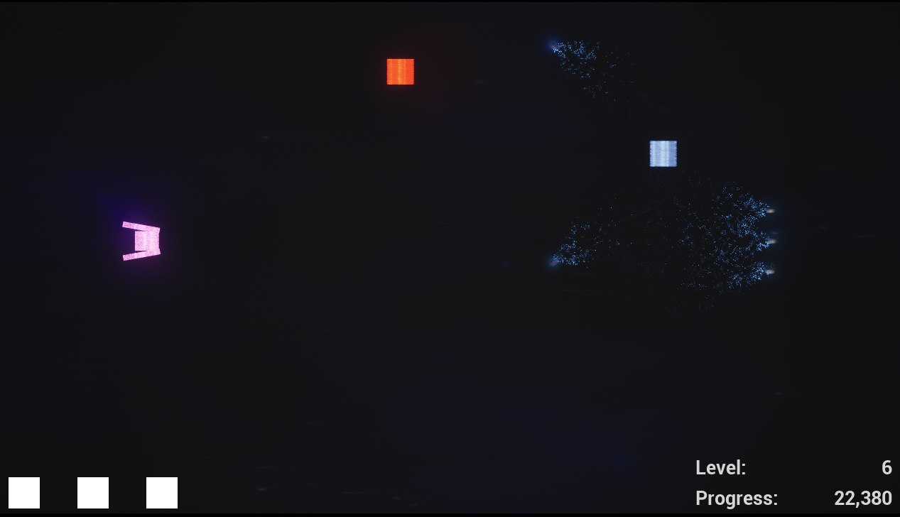

# Space Shooter en Unreal

Un juego tipo space shooter creado en Unreal, que incluye las siguientes características:

- Un escenario con cámara ortográfica, límites, un material de fondo que simula movimiento, etc.
- Un HUD con información del progreso, vidas, nivel actual y fin de partida.
- Un game mode que gestiona la lógica del juego.
- Un character con movimiento, disparo y gestión de colisiones.
- Enemigos
    - Un enemigo base con movimiento, disparo automático y gestión de colisiones.
    - Un enemigo que extiende del base y realiza un movimiento de rebote de lado a lado. 
    - Un tipo de enemigo que avanza y realiza 2 disparos en diagonal. 
    - Un tipo de enemigo que aparece y desaparece cada cierto tiempo. 
    - Un generador de enemigos con varios puntos de generación, una frecuencia y una selección aleatoria de qué enemigo generar en base al nivel actual de juego.
- Power ups
    - Que aumenta la frecuencia de los disparos, se puede coger varias veces hasta llegar a un límite.
    - Que activa un disparo triple del player. 
    - Generador de power ups aleatorio cada cierto tiempo.
 